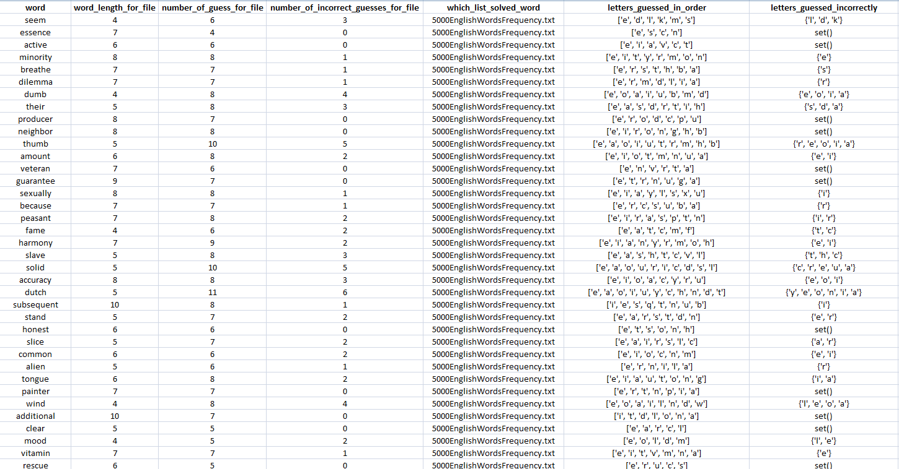
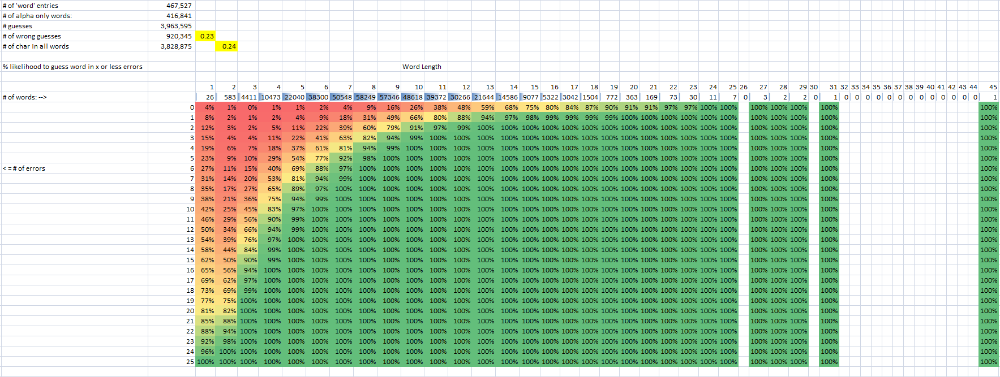
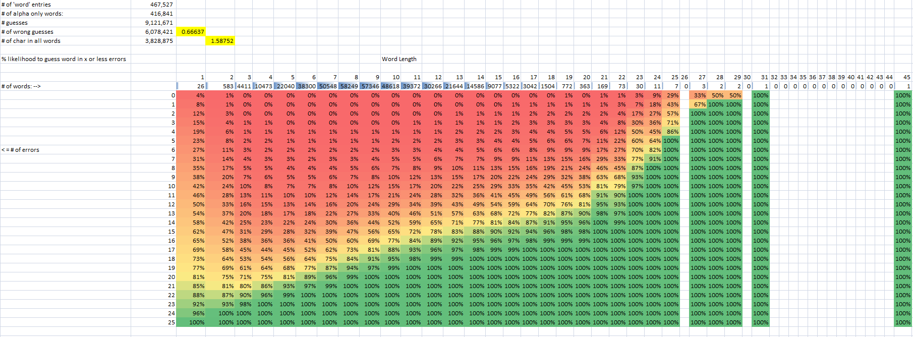

# Hangman-Stats-In-Context---Python

Determine number of guesses needed to solve each word in a list given a strategy of guessing the most frequent occurring letter. The number of guesses to solve a word will change depending on the members of the list (i.e. a word list with 1 million entries will have a different distribution of letters compared to one with 1,000 words). This algorithm uses word length and letter position to determine the next guess.

A guess of "e" with feedback of _ _ e _ (4 letters with e only in index 2) will eliminate "feed" as a possible word. A list of all 4 letter words that meet the criteria is created and frequency count of the sets of letters is done to generate the next guess.

1. Provide word lists   
    The current setup uses 2 word lists.
    * "5000EnglishWordsFrequency.txt" is a high frequency word list (not quite 5000 words).
    * "words.txt" is a large word list (with lots of junk entries within the shorter words -ex: AAAAAA).
        The idea is that for shorter words, a high frequency list will likely catch words that are shorter without having to look at the bigger list. When guesses using the smaller list are exhausted, the program searches the bigger list and creates a frequency count based on the larger list.

2. If you want to skip the first list, change word_group in computer_guess_word() to which ever list you want to start with.

3. Run selfTestWords.py and worddata.csv will be created which generates the following:
    * word
    * word length
    * number of guesses
    * number of incorrect guesses
    * which file solved the word (ex:"5000EnglishWordsFrequency.txt" or "words.txt" )
    * letters guessed (in order of guess)
    * letters guessed incorrectly (provided as a set)

#
Example of worddata.csv output for just "5000EnglishWordsFrequency.txt" checked against itself 
 

#
After creating worddata.csv, you can use excel to bring more context to your data. The grid below can be read as follows:
For 9 letter words (of which there were 57,346 in words.txt), there was a 94% chance of guessing a word with 3 or fewer errors and there was a 100% percent chance a word would be guessed with 5 or fewer errors. 
 

#

Below is an example of what happens if you use a strategy of solving with the lowest frequency letter (not the best strategy).
Use:
* for x in reversed(letter_frequency_just_letters_in_order)     
instead of 
* for x in letter_frequency_just_letters_in_order: 
    
 

